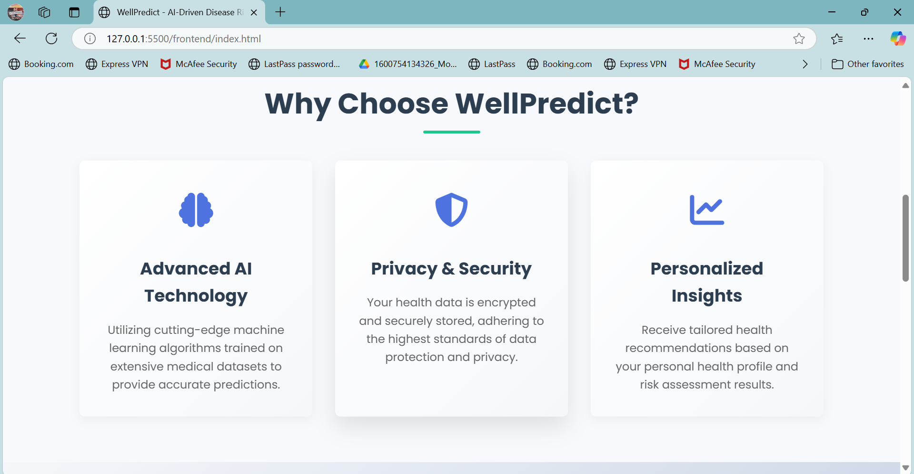
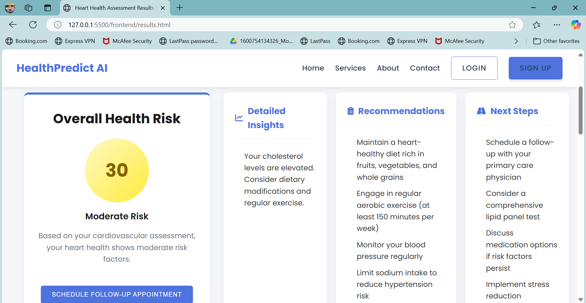

# WellPredict 🩺

## AI-Driven Disease Risk Prediction System

WellPredict is a smart health assessment platform that uses machine learning models to predict disease risk factors and provide personalized health insights.


## 📋 Table of Contents
- [Overview](#-overview)
- [Features](#-features)
- [Technologies Used](#-technologies-used)
- [Project Structure](#-project-structure)
- [Getting Started](#-getting-started)
- [API Documentation](#-api-documentation)
- [Screenshots](#-screenshots)
- [Contributing](#-contributing)
- [Contact](#-contact)

## 🔍 Overview

WellPredict is a comprehensive health risk assessment platform that combines modern web technologies with machine learning to provide accurate disease risk predictions. The system features a FastAPI backend with trained ML models for heart disease and diabetes risk assessment, delivering personalized health insights through an intuitive web interface.

## ✨ Features

- **🔐 User Authentication System** - Secure login/signup with localStorage persistence
- **❤️ Heart Disease Risk Assessment** - ML-powered cardiovascular risk prediction using 13 clinical parameters
- **🩺 Diabetes Risk Prediction** - Advanced diabetes risk analysis with 8+ health indicators
- **📊 Interactive Results Dashboard** - Beautiful visualizations with charts, risk gauges, and detailed analytics
- **💡 Personalized Health Recommendations** - AI-generated actionable health advice based on individual risk factors
- **📱 Responsive Design** - Seamless experience across all devices and screen sizes
- **📈 Data Visualizations** - Interactive charts showing risk distributions and health metrics
- **📄 PDF Report Generation** - Downloadable comprehensive health assessment reports
- **🔗 Health Resources** - Additional resources and specialist recommendations
- **⚡ Real-time Processing** - Fast ML predictions with confidence scoring
- **🧪 Sample Data Testing** - Built-in test data for development and demonstration

## 💻 Technologies Used

### 🎨 Frontend
- **HTML5** - Modern semantic markup with responsive design
- **CSS3** - Advanced styling with Flexbox/Grid, animations, and custom properties
- **JavaScript (ES6+)** - Modern client-side programming with modules and async/await
- **Chart.js** - Interactive data visualizations and charts
- **Font Awesome 6.4.0** - Professional icon library
- **Google Fonts (Inter)** - Typography
- **jsPDF** - Client-side PDF generation
- **HTML2Canvas** - Screenshot capabilities for reports

### ⚙️ Backend
- **FastAPI** - Modern, fast Python web framework with automatic API documentation
- **Uvicorn** - Lightning-fast ASGI server for production
- **Pydantic** - Data validation and serialization with type hints
- **Python 3.13** - Latest Python version with enhanced performance
- **CORS Middleware** - Cross-origin resource sharing configuration

### 🤖 Machine Learning
- **Scikit-learn** - ML model training, evaluation, and inference
- **Joblib** - Efficient model serialization and loading
- **Pandas** - Data manipulation and analysis
- **NumPy** - Numerical computing and array operations
- **StandardScaler** - Feature normalization and preprocessing
- **Pre-trained Models** - Heart disease and diabetes prediction models (.pkl files)

### 📊 Data & Storage
- **LocalStorage** - Client-side data persistence for user sessions
- **JSON** - Data exchange format between frontend and backend
- **Excel (.xlsx)** - Training datasets for model development

### 🛠️ Development Tools
- **Python Virtual Environment** - Dependency isolation
- **Git** - Version control
- **VS Code** - Development environment
- **PowerShell Scripts** - Project automation and cleanup
- **Batch Scripts** - Server startup automation

## 📁 Project Structure

```
AI-Driven-Disease-Risk-Prediction-System/
├── 🎨 frontend/                    # Frontend application
│   ├── index.html                 # Landing page
│   ├── predict.html               # Prediction forms
│   ├── results-perfect.html       # Professional results dashboard (current)
│   ├── results.html               # Original results page (deprecated)
│   ├── login.html & signup.html   # Authentication pages
│   ├── about.html & contact.html  # Information pages
│   ├── services.html              # Services overview
│   ├── profile.html               # User profile management
│   ├── components/                # Reusable HTML components
│   │   ├── header.html            # Navigation header
│   │   └── footer.html            # Page footer
│   ├── css/                       # Stylesheets
│   │   ├── styles.css            # Global styles
│   │   ├── global.css            # Additional global styles
│   │   └── pages/                # Page-specific styles
│   │       ├── index.css         # Home page styles
│   │       ├── predict.css       # Prediction form styles
│   │       ├── results.css       # Results page styles
│   │       └── [other pages].css # Individual page styles
│   ├── js/                       # JavaScript modules
│   │   ├── api-client.js         # API communication and form handling
│   │   ├── perfect-results.js    # Modern results processing
│   │   ├── results.js            # Original results logic (deprecated)
│   │   ├── predict.js            # Form validation and submission
│   │   ├── login.js & signup.js  # Authentication logic
│   │   ├── profile.js            # Profile management
│   │   └── main.js               # Global JavaScript functionality
│   └── images/                   # UI assets and branding
│       ├── logo.jpg              # Application logo
│       ├── background.jpg        # Hero section background
│       └── [feature images].jpg  # Feature-specific images
│
├── ⚙️ backend/                     # FastAPI backend
│   ├── main.py                    # FastAPI application entry point
│   ├── models/                    # ML model wrapper classes
│   │   ├── __init__.py           # Package initialization
│   │   ├── heart_model.py        # Heart disease prediction model
│   │   └── diabetes_model.py     # Diabetes prediction model
│   ├── schemas/                   # Pydantic data validation schemas
│   │   ├── __init__.py           # Package initialization
│   │   └── prediction_schemas.py # Request/response models
│   ├── requirements.txt           # Python dependencies
│   ├── start.bat                 # Windows server startup script
│   ├── start.sh                  # Unix/Linux server startup script
│   ├── test_system.py            # System testing utilities
│   └── logs/                     # Application logs
│       └── app.log               # FastAPI server logs
│
├── 🤖 ML_prediction/              # Machine Learning assets
│   ├── flask-diabetes/            # Diabetes model files (required for backend)
│   │   ├── model.pkl             # Trained diabetes ML model
│   │   ├── scaler.pkl            # Data preprocessing scaler
│   │   └── [legacy files]        # Original Flask implementation
│   ├── flask-heart/               # Heart disease model files (required for backend)
│   │   ├── model.pkl             # Trained heart disease ML model
│   │   ├── scaler.pkl            # Data preprocessing scaler
│   │   └── [legacy files]        # Original Flask implementation
│   ├── enhanced_diabetes_dataset.xlsx # Training data (optional)
│   └── heart.xlsx                 # Training data (optional)
│
├── 📸 screenshots/                # Documentation images
│   ├── logo.png                  # README logo
│   ├── HomePage[1-3].png         # Home page screenshots
│   ├── PredictionInterface[1-3].png # Prediction form screenshots
│   ├── Results[1-4].png          # Results page screenshots
│   └── LoginPage.png             # Login page screenshot
│
├── 📋 cleanup-project.ps1         # PowerShell cleanup script
├── 📋 CLEANUP_PLAN.md            # Cleanup documentation
├── 📄 BACKEND_SETUP.md           # Backend setup instructions
├── 📄 requirements.txt           # Legacy requirements (deprecated)
├── 📄 LICENSE                    # Project license
└── 📄 README.md                  # This documentation file
```

## 🚀 Getting Started

### Prerequisites
- **Python 3.8+** (Python 3.13 recommended)
- **Modern web browser** (Chrome, Firefox, Safari, Edge)
- **Code editor** (VS Code recommended)
- **Git** (for cloning the repository)

### Quick Start

1. **Clone the repository**
   ```bash
   git clone https://github.com/your-username/AI-Driven-Disease-Risk-Prediction-System.git
   cd AI-Driven-Disease-Risk-Prediction-System
   ```

2. **Backend Setup**
   ```bash
   # Navigate to backend directory
   cd backend
   
   # Create virtual environment
   python -m venv venv
   
   # Activate virtual environment
   # Windows:
   venv\Scripts\activate
   # Unix/MacOS:
   source venv/bin/activate
   
   # Install dependencies
   pip install -r requirements.txt
   
   # Start the FastAPI server
   python main.py
   # OR use the startup script:
   # Windows: start.bat
   # Unix/MacOS: ./start.sh
   ```
   
   The backend will start on `http://localhost:8000`

3. **Frontend Setup**
   ```bash
   # Navigate to frontend directory
   cd frontend
   
   # Option 1: Using VS Code Live Server
   # - Install "Live Server" extension in VS Code
   # - Right-click on index.html
   # - Select "Open with Live Server"
   
   # Option 2: Using Python's built-in server
   python -m http.server 5500
   
   # Option 3: Using Node.js (if installed)
   npx serve .
   ```
   
   The frontend will be available at `http://localhost:5500` (or similar)

4. **Access the Application**
   - Open your browser and navigate to the frontend URL
   - Create an account or use the demo features
   - Try the prediction forms with sample data
   - View results on the professional results dashboard

### Development Mode

For development, you'll want both servers running:

**Terminal 1 - Backend:**
```bash
cd backend
venv\Scripts\activate  # Windows
# source venv/bin/activate  # Unix/MacOS
python main.py
```

**Terminal 2 - Frontend:**
```bash
cd frontend
# Use your preferred method from above
```

### Testing the System

The system includes built-in test data for development:
- Use the "Load Sample Data" buttons on the prediction forms
- Check the browser console for detailed logging
- Visit `http://localhost:8000/docs` for interactive API documentation
- Run `python test_system.py` in the backend directory for system tests

## � API Documentation

The FastAPI backend provides a RESTful API with automatic interactive documentation.

### Base URL
```
http://localhost:8000
```

### Interactive Documentation
- **Swagger UI**: `http://localhost:8000/docs`
- **ReDoc**: `http://localhost:8000/redoc`

### Endpoints

#### Health Check
```http
GET /health
```
Returns the system health status.

#### Heart Disease Prediction
```http
POST /predict/heart
Content-Type: application/json

{
  "age": 63,
  "sex": 1,
  "cp": 3,
  "trestbps": 145,
  "chol": 233,
  "fbs": 1,
  "restecg": 0,
  "thalach": 150,
  "exang": 0,
  "oldpeak": 2.3,
  "slope": 0,
  "ca": 0,
  "thal": 1
}
```

**Response:**
```json
{
  "prediction": 1,
  "probability": 0.85,
  "risk_level": "high",
  "confidence": 0.92,
  "message": "High risk of heart disease detected"
}
```

#### Diabetes Prediction
```http
POST /predict/diabetes
Content-Type: application/json

{
  "pregnancies": 6,
  "glucose": 148,
  "blood_pressure": 72,
  "skin_thickness": 35,
  "insulin": 0,
  "bmi": 33.6,
  "diabetes_pedigree": 0.627,
  "age": 50
}
```

**Response:**
```json
{
  "prediction": 1,
  "probability": 0.73,
  "risk_level": "high",
  "confidence": 0.88,
  "message": "High risk of diabetes detected"
}
```

### Error Handling
The API returns standard HTTP status codes and detailed error messages:

```json
{
  "detail": "Validation error: Invalid input data",
  "error_code": "VALIDATION_ERROR"
}
```

### CORS Configuration
The API is configured to accept requests from:
- `http://localhost:5500` (default frontend development server)
- `http://127.0.0.1:5500`
- Any VS Code Live Server port


### Home Page




### Prediction Interface
 
 
 

### Results Display
 
 
 
 

### Login Page


## 🤖 Machine Learning Models

### Heart Disease Prediction Model
- **Features**: 13 clinical parameters including age, chest pain type, blood pressure, cholesterol, etc.
- **Algorithm**: Trained using scikit-learn (likely Random Forest or Logistic Regression)
- **Output**: Risk probability (0-1) with classification
- **Risk Levels**: 
  - Low: < 0.3 (30%)
  - Moderate: 0.3-0.6 (30%-60%)
  - High: > 0.6 (60%+)
- **Model Files**: `ML_prediction/flask-heart/model.pkl`, `scaler.pkl`

### Diabetes Prediction Model
- **Features**: 8+ clinical and lifestyle parameters including glucose levels, BMI, age, etc.
- **Algorithm**: Trained using scikit-learn
- **Output**: Risk probability (0-1) with classification
- **Risk Levels**: 
  - Low: < 0.3 (30%)
  - Moderate: 0.3-0.6 (30%-60%)
  - High: > 0.6 (60%+)
- **Model Files**: `ML_prediction/flask-diabetes/model.pkl`, `scaler.pkl`

### Data Preprocessing
Both models use StandardScaler for feature normalization, ensuring consistent input scaling for optimal prediction accuracy.

## 🛠️ Development & Deployment

### Project Cleanup
Run the PowerShell cleanup script to remove legacy files:
```powershell
.\cleanup-project.ps1
```

This will archive old Flask implementations and unnecessary files while preserving required model files.

### Logging
- **Backend logs**: `backend/logs/app.log`
- **Console logging**: Available in browser developer tools
- **Log levels**: INFO, DEBUG, WARNING, ERROR

### Performance Optimization
- FastAPI provides automatic request/response validation
- ML models are loaded once at startup for optimal performance
- CORS middleware configured for secure cross-origin requests
- Compressed model files using joblib for fast loading

## 🚀 Deployment Considerations

### Production Setup
1. **Environment Variables**: Set production configuration
2. **SSL/TLS**: Configure HTTPS for secure communication
3. **Database**: Consider adding persistent storage for user data
4. **Monitoring**: Implement health checks and monitoring
5. **Scaling**: Use containers (Docker) for easy deployment

### Security Best Practices
- Input validation on both frontend and backend
- CORS configuration for allowed origins
- Rate limiting (recommended for production)
- Secure headers and HTTPS enforcement
- Regular dependency updates

## 🤝 Contributing

1. **Fork the repository**
2. **Create a feature branch**: `git checkout -b feature/amazing-feature`
3. **Commit changes**: `git commit -m 'Add amazing feature'`
4. **Push to branch**: `git push origin feature/amazing-feature`
5. **Open a Pull Request**

### Development Guidelines
- Follow PEP 8 for Python code
- Use meaningful commit messages
- Add comments for complex logic
- Test changes thoroughly
- Update documentation as needed

## 📄 License

This project is licensed under the MIT License - see the [LICENSE](LICENSE) file for details.

## 📞 Contact

Created by **Ashi Mariyam Thomas**

- **Email**: [ashnimariyamt@gmail.com](mailto:ashnimariyamt@gmail.com)
- **LinkedIn**: [www.linkedin.com/in/ashithomas](https://www.linkedin.com/in/ashithomas)
- **GitHub**: [https://github.com/ashimariyam](https://github.com/ashimariyam)

---

© 2024 WellPredict. All rights reserved. This project is for educational and research purposes.
